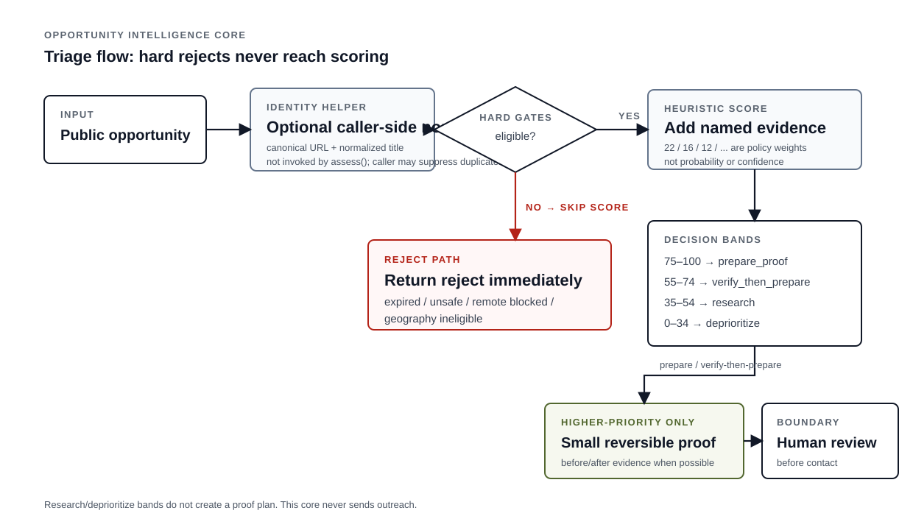

# Opportunity Intelligence Core

**A lead is not a client. A reply is not revenue. A spreadsheet row wearing a tie is still a spreadsheet row.**

This is the public scoring/triage slice from my private acquisition systems.

It does **not** send outreach. It decides which public opportunities deserve more investigation, which should be rejected immediately, and which are worth building a small proof for before a human chooses what to do next.

## What the score means

Not probability.

Not “AI confidence.”

Not “83% chance this person buys.”

The score is just an inspectable attention rubric built from explicit evidence such as paid intent, fit, urgency, freshness, and proofability.

Some conditions are stronger than a score and become hard rejects instead.

## Repo map

| Area | Responsibility |
|---|---|
| `models.py` | opportunity + assessment records |
| `normalization.py` | canonical URLs and duplicate keys |
| `gates.py` | hard rejection conditions |
| `scoring.py` | additive evidence rubric |
| `planning.py` | small reversible proof plan |
| `core.py` | assessment facade |
| `tests/` | normalization, gates, score, planning |
| `docs/` | design reasoning |

The private systems add discovery, evidence collection, operator review, and real outcome tracking. This repo keeps the part that can be reviewed without private contact data or account access.

> A high score means “look here first,” not “start spending the imaginary commission.”
