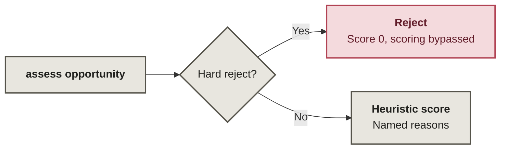
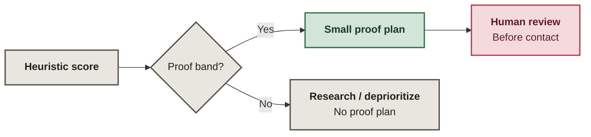

# Opportunity Intelligence Core

Deterministic triage for public opportunities: reject ineligible work before scoring, apply a transparent heuristic policy, and stop higher-priority cases at human review before any contact.

**Hard rejects do not get consolation points.**

This public sample comes from my private acquisition tooling. It makes the triage policy inspectable; I can adapt the rubric and build the surrounding discovery, review, and application workflows. Account access, contact data, submissions, messaging, and payment behavior stay outside this sample.

## Eligibility: reject before spending effort on a score

Dangerous or regulated scope, expiry, remote ineligibility, or geography ineligibility triggers rejection. `assess()` returns before calling `score()`.

Identity cleanup is optional caller-side work: `assess()` does not call `canonical_url()` or `duplicate_key()`.

## Priority: prepare evidence, then stop for review

Only `prepare_proof` and `verify_then_prepare` produce a proof plan. Its final step is `human_review_before_contact`; the module performs no contact. Lower bands return no proof plan.

`canonical_url()` removes known tracking parameters and fragments while retaining identity-bearing query parameters. It preserves repeated-key value order while canonicalizing keys. `duplicate_key()` combines the URL with a normalized title.

## What the score means

`scoring.py` returns the positive contributions and penalties in `reasons`.

The `22/16/12/...` weights are **explicit policy choices**, not learned parameters, probabilities, or calibrated conversion estimates. No dataset or outcome study derives them here. A higher score means only “inspect this first under the current rubric.”

| Score / gate | Decision | Next step |
|---|---|---|
| Any hard reject | `reject` | Stop; scoring is bypassed |
| 75–100 | `prepare_proof` | Build a small reversible proof, then human review |
| 55–74 | `verify_then_prepare` | Verify missing evidence, then prepare proof |
| 35–54 | `research` | Gather evidence; no proof plan |
| 0–34 | `deprioritize` | Spend attention elsewhere |

## Inspect the implementation

| File | What to verify |
|---|---|
| [`src/opportunity_intelligence/normalization.py`](src/opportunity_intelligence/normalization.py) | conservative URL canonicalization and deterministic duplicate identity |
| [`src/opportunity_intelligence/gates.py`](src/opportunity_intelligence/gates.py) | hard rejection conditions |
| [`src/opportunity_intelligence/scoring.py`](src/opportunity_intelligence/scoring.py) | visible additive heuristic and decision bands |
| [`src/opportunity_intelligence/planning.py`](src/opportunity_intelligence/planning.py) | small proof plan ending in human review |
| [`src/opportunity_intelligence/core.py`](src/opportunity_intelligence/core.py) | hard gates return before scoring |
| [`tests/`](tests/) | strong opportunity, hard reject, query-safe duplicate identity, bands, planning |

Verification commands and what they prove: [`docs/verification.md`](docs/verification.md).

## What the score cannot tell you

The repository proves deterministic triage behavior only. It does not claim predictive accuracy, production conversion performance, or automatic outreach.

See [`PROVENANCE.md`](PROVENANCE.md) for the scoring and extraction history.
