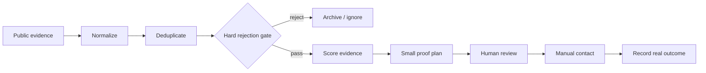

# Opportunity Intelligence Core

**A lead is not a client. A reply is not revenue. A spreadsheet row wearing a tie is still a spreadsheet row.**

This repo is a public, sanitized slice of the scoring logic behind my private client-acquisition systems. It turns public opportunity evidence into a deterministic score, applies hard rejection gates, deduplicates obvious repeats, and produces a small proof plan for human review.

It does **not** send outreach.

## Workflow



## What it measures

- explicit buying intent;
- budget evidence;
- urgency;
- technical fit;
- proof opportunity;
- buyer/source confidence;
- competition/risk;
- geographic eligibility;
- stale/duplicate penalties.

A high score does not mean “client secured.” It means “this deserves more attention than the lower-scoring pile.”

## Run

```bash
PYTHONPATH=src python -m unittest discover -s tests
```

## Example

```python
from opportunity_intelligence.core import Opportunity, assess

opportunity = Opportunity(
    title="Need help fixing webhook failures",
    source_url="https://example.test/request/42",
    explicit_paid_intent=True,
    budget_known=True,
    technical_fit=True,
    proof_possible=True,
    fresh=True,
)

print(assess(opportunity))
```

## Boundary

No scraping bypass, marketplace login, prospect database, private contact data, automatic email, proposal submission, payment action, or fake “conversion probability” is included.

## Provenance

Rewritten from the deterministic scoring and manual-review boundaries in my private `revenue-hunter` and `acquisition-autopilot` repositories.
