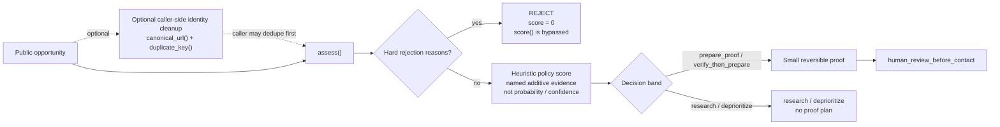

# Opportunity Intelligence Core

Deterministic triage for public opportunities: reject ineligible work before scoring, apply a transparent heuristic policy, and stop higher-priority cases at human review before any contact.

This is the public decision core extracted from private acquisition tooling. It contains no discovery accounts, contact data, proposal submission, messaging, or payment behavior.

The dotted identity path is optional caller-side work: `assess()` does not call `canonical_url()` or `duplicate_key()`. Hard rejects do not get consolation points; `assess()` returns before `score()`.

## How the flow works

1. **Optional identity cleanup.** `canonical_url()` removes known tracking parameters and URL fragments while preserving other query parameters that can identify a distinct opportunity. `duplicate_key()` combines that URL with a normalized title.
2. **Hard gates first.** Dangerous or regulated scope, expiry, remote ineligibility, or geography ineligibility returns `decision="reject"` immediately.
3. **Heuristic policy scoring.** Eligible rows receive named positive contributions and penalties from `scoring.py`; every contribution is returned in `reasons`.
4. **Decision band.** The score controls triage priority, not predicted outcomes.
5. **Higher-priority proof planning.** Only `prepare_proof` and `verify_then_prepare` create a small reversible proof plan, which ends at `human_review_before_contact`.

The URL canonicalizer is deliberately conservative: known tracking noise is removed, identity-bearing query parameters are retained, and repeated-key value order is preserved while keys are canonicalized.

## What the score means

The exact `22/16/12/...` values are **explicit default policy weights used for prioritization**. They are not learned parameters, probabilities, confidence scores, or calibrated estimates of conversion likelihood.

The public repository contains no dataset, calibration report, controlled experiment, or outcome history that empirically derives those exact values. A higher score means only “inspect this first under the current rubric.”

| Score / gate | Decision | Next step |
|---|---|---|
| Any hard reject | `reject` | Stop; scoring is bypassed |
| 75–100 | `prepare_proof` | Build a small reversible proof, then human review |
| 55–74 | `verify_then_prepare` | Verify missing evidence, then prepare proof |
| 35–54 | `research` | Gather evidence; no proof plan |
| 0–34 | `deprioritize` | Spend attention elsewhere |

## Inspect the implementation

| File | What to verify |
|---|---|
| [`src/opportunity_intelligence/normalization.py`](src/opportunity_intelligence/normalization.py) | conservative URL canonicalization and deterministic duplicate identity |
| [`src/opportunity_intelligence/gates.py`](src/opportunity_intelligence/gates.py) | hard rejection conditions |
| [`src/opportunity_intelligence/scoring.py`](src/opportunity_intelligence/scoring.py) | visible additive heuristic and decision bands |
| [`src/opportunity_intelligence/planning.py`](src/opportunity_intelligence/planning.py) | small proof plan ending in human review |
| [`src/opportunity_intelligence/core.py`](src/opportunity_intelligence/core.py) | hard gates return before scoring |
| [`tests/`](tests/) | strong opportunity, hard reject, query-safe duplicate identity, bands, planning |

Verification commands and what they prove: [`docs/verification.md`](docs/verification.md).

## Limits and provenance

The repository proves deterministic triage behavior only. It does not claim predictive accuracy, production conversion performance, or automatic outreach.

See [`PROVENANCE.md`](PROVENANCE.md) for the scoring and extraction history.
